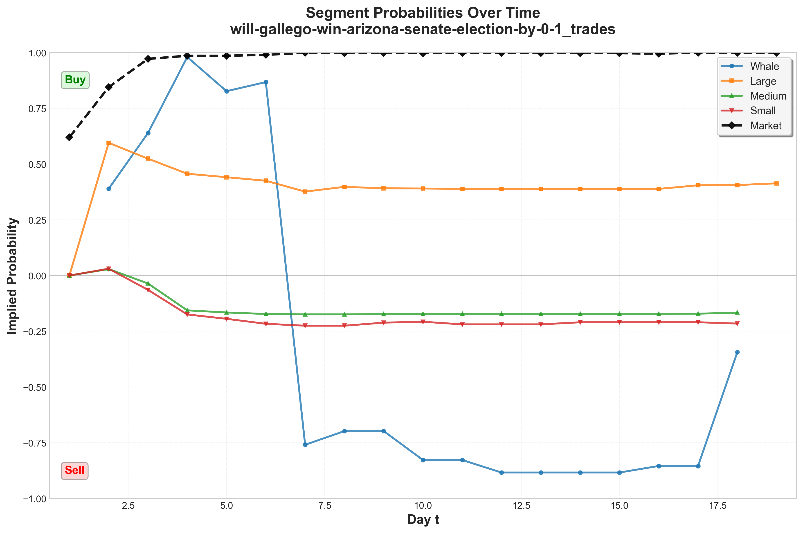

<div align="center">

# 🔍 Example Workflow: Step-by-Step Data Transformation

**Created:** December 5, 2024

**Example Market:** `will-gallego-win-arizona-senate-election-by-0-1`

**Event:** `arizona-senate-election-margin-of-victory`

---

## 📋 Overview

This document traces the complete data transformation pipeline for a single market, showing how raw trade data flows through each processing step to produce final visualizations.

</div>

---

## 🗂️ Input Files

### 1. Raw Trade Data

**Location:** `raw/arizona-senate-election-margin-of-victory/trades/will-gallego-win-arizona-senate-election-by-0-1_trades.csv`

**Sample Columns:**
```
proxyWallet, side, size, price, timestamp, outcome, ...
```

**Key Fields:**
- `side`: "BUY" or "SELL"
- `size`: Trade quantity (used for segmentation)
- `outcome`: "Yes" or "No"
- `timestamp`: Unix timestamp

**Example Row:**
```
0xabc..., BUY, 100.5, 0.65, 1731103202, Yes, ...
```

---

### 2. Raw Price Data

**Location:** `raw/arizona-senate-election-margin-of-victory/prices/will-gallego-win-arizona-senate-election-by-0-1_price.csv`

**Columns:**
```
market_slug, price, timestamp, token_id
```

**Purpose:** Official market YES probability over time

---

## 🔄 Processing Steps

### **Step 1: Load & Segment Trades** ✂️

**Script:** `segment_trades.py` → `process_event()`

**Process:**

1. **Load trade file:**
   ```python
   df = pd.read_csv("will-gallego-win-arizona-senate-election-by-0-1_trades.csv")
   ```

2. **Calculate segmentation thresholds:**
   ```
   mean_size = 45.2
   std_size = 28.7
   whale_threshold = 45.2 + 2 × 28.7 = 102.6
   
   q33 = 15.3  (33rd percentile)
   q66 = 68.9  (66th percentile)
   ```

3. **Assign segments:**
   - Trade with size = 120 → **Whale** (≥ 102.6)
   - Trade with size = 75 → **Large** (≥ 68.9)
   - Trade with size = 40 → **Medium** (≥ 15.3)
   - Trade with size = 10 → **Small** (< 15.3)

4. **Add day index:**
   - Earliest timestamp: 2024-11-08 → Day 1
   - Trade on 2024-11-09 → Day 2
   - Trade on 2024-11-26 → Day 19

**Output Files:**
- ✅ `output/.../small.csv`
- ✅ `output/.../medium.csv`
- ✅ `output/.../large.csv`
- ✅ `output/.../whale.csv`

**Sample Output (small.csv):**
```csv
proxyWallet,side,size,outcome,timestamp,day,segment
0x123...,BUY,10.5,Yes,1731103202,1,Small
0x456...,SELL,8.2,No,1731106802,2,Small
```

---

### **Step 2: Calculate Daily Net Positions** 📊

**Script:** `segment_trades.py` → `compute_daily_panel()`

**Process (for Small segment):**

**Day 1:**
```
YES buys:  Σ(size where side=BUY, outcome=Yes) = 50.0
YES sells: Σ(size where side=SELL, outcome=Yes) = 20.0
YES_net_1 = 50.0 - 20.0 = 30.0

NO buys:   Σ(size where side=BUY, outcome=No) = 15.0
NO sells:  Σ(size where side=SELL, outcome=No) = 5.0
NO_net_1 = 15.0 - 5.0 = 10.0

H_Y_1 = 30.0
H_N_1 = 10.0
```

**Day 2:**
```
YES_net_2 = 25.0 - 15.0 = 10.0
NO_net_2 = 8.0 - 12.0 = -4.0

H_Y_2 = H_Y_1 + YES_net_2 = 30.0 + 10.0 = 40.0
H_N_2 = H_N_1 + NO_net_2 = 10.0 + (-4.0) = 6.0
```

**Day 3 (no trades):**
```
H_Y_3 = H_Y_2 = 40.0  (forward-filled)
H_N_3 = H_N_2 = 6.0   (forward-filled)
```

**Calculate Probability:**
```
Day 1: p = 30.0 / (|30.0| + |10.0|) = 30.0 / 40.0 = 0.75
Day 2: p = 40.0 / (|40.0| + |6.0|) = 40.0 / 46.0 = 0.87
Day 3: p = 40.0 / (|40.0| + |6.0|) = 0.87  (same as Day 2)
```

**Output File:**
- ✅ `small_daily_panel.csv`

**Sample Output:**
```csv
segment,market_id,day,H_Y_jt,H_N_jt,p_segment_t
Small,will-gallego-win-arizona-senate-election-by-0-1_trades,1,30.0,10.0,0.75
Small,will-gallego-win-arizona-senate-election-by-0-1_trades,2,40.0,6.0,0.87
Small,will-gallego-win-arizona-senate-election-by-0-1_trades,3,40.0,6.0,0.87
```

---

### **Step 3: Merge All Segments** 🔗

**Script:** `segment_trades.py` → `merge_segment_panels_with_market_prob()`

**Process:**

1. **Load all 4 segment daily panels:**
   - `small_daily_panel.csv` → extract `p_segment_t` → rename to `p_small`
   - `medium_daily_panel.csv` → extract `p_segment_t` → rename to `p_medium`
   - `large_daily_panel.csv` → extract `p_segment_t` → rename to `p_large`
   - `whale_daily_panel.csv` → extract `p_segment_t` → rename to `p_whale`

2. **Merge on day:**
   ```python
   merged = small.merge(medium, on='day', how='outer')
   merged = merged.merge(large, on='day', how='outer')
   merged = merged.merge(whale, on='day', how='outer')
   ```

3. **Load and align price data:**
   - Load `will-gallego-win-arizona-senate-election-by-0-1_price.csv`
   - Convert timestamps to day indices (aligned with trade days)
   - Group by day, take last price of each day
   - Merge as `p_market`

**Output File:**
- ✅ `merged_panel.csv`

**Sample Output:**
```csv
day,p_whale,p_large,p_medium,p_small,p_market
1,,0.0,0.0,0.0,0.62
2,0.389,0.595,0.029,0.031,0.845
3,0.639,0.524,-0.035,-0.064,0.972
4,0.980,0.457,-0.156,-0.175,0.986
```

---

### **Step 4: Visualize** 📊

**Script:** `plot_segment_probabilities.py`

**Process:**

1. **Load merged panel:**
   ```python
   df = pd.read_csv("merged_panel.csv")
   ```

2. **Create Matplotlib plot:**
   - Plot 5 lines (whale, large, medium, small, market)
   - Add y=0 reference line
   - Add "Buy"/"Sell" labels
   - Set Y-axis to [-1, 1]

3. **Create Plotly plot:**
   - Same data, interactive version
   - Hover tooltips

**Output Files:**
- ✅ `plots/*_probabilities.png`
- ✅ `plots/*_probabilities.pdf`
- ✅ `plots/*_probabilities.html`

---

## 📊 Visual Result



**Interpretation:**
- 🐋 **Whale** (blue): Strong net YES position, peaks around day 4
- 🔶 **Large** (orange): Moderate net YES position, declining over time
- 🔷 **Medium** (green): Starts positive, becomes negative (net NO)
- 🔸 **Small** (red): Similar to medium, becomes negative
- ⚫ **Market** (black dashed): Official probability, steadily increasing

**Key Observations:**
- Whale and Large segments show bullish sentiment (positive values)
- Medium and Small segments show bearish sentiment (negative values)
- Market price increases despite mixed segment sentiment
- Divergence between large traders (whale/large) and small traders (medium/small)

---

## 🔢 Complete Data Flow

```
┌─────────────────────────────────────────────────────────┐
│ 1. Raw Trade File                                       │
│    will-gallego-..._trades.csv                         │
│    (proxyWallet, side, size, outcome, timestamp, ...)   │
└──────────────────┬──────────────────────────────────────┘
                   │
                   ▼
┌─────────────────────────────────────────────────────────┐
│ 2. Segmentation                                         │
│    • Calculate thresholds (whale, q33, q66)            │
│    • Assign segments (Small/Medium/Large/Whale)         │
│    • Add day index                                      │
└──────────────────┬──────────────────────────────────────┘
                   │
                   ▼
┌─────────────────────────────────────────────────────────┐
│ 3. Segmented Files                                      │
│    small.csv, medium.csv, large.csv, whale.csv         │
│    (original data + segment + day columns)             │
└──────────────────┬──────────────────────────────────────┘
                   │
                   ▼
┌─────────────────────────────────────────────────────────┐
│ 4. Daily Panel Calculation                             │
│    • Compute H_Y_jt (cumulative YES net)                │
│    • Compute H_N_jt (cumulative NO net)                 │
│    • Calculate p_segment_t = H_Y / (|H_Y| + |H_N|)      │
└──────────────────┬──────────────────────────────────────┘
                   │
                   ▼
┌─────────────────────────────────────────────────────────┐
│ 5. Daily Panel Files                                   │
│    small_daily_panel.csv, medium_daily_panel.csv, ...  │
│    (segment, market_id, day, H_Y_jt, H_N_jt, p_seg_t)  │
└──────────────────┬──────────────────────────────────────┘
                   │
                   ▼
┌─────────────────────────────────────────────────────────┐
│ 6. Merge with Price Data                               │
│    • Load all 4 segment panels                         │
│    • Extract p_segment_t → rename to p_whale, etc.      │
│    • Load price CSV, convert to day indices             │
│    • Merge on day                                       │
└──────────────────┬──────────────────────────────────────┘
                   │
                   ▼
┌─────────────────────────────────────────────────────────┐
│ 7. Merged Panel                                        │
│    merged_panel.csv                                     │
│    (day, p_whale, p_large, p_medium, p_small, p_market)│
└──────────────────┬──────────────────────────────────────┘
                   │
                   ▼
┌─────────────────────────────────────────────────────────┐
│ 8. Visualization                                       │
│    • Matplotlib: PNG, PDF                               │
│    • Plotly: HTML                                       │
└─────────────────────────────────────────────────────────┘
```

---

## 📐 Formulas Used

### Segmentation

```
whale_threshold = mean(size) + 2 × std(size)

if size ≥ whale_threshold:
    segment = "Whale"
elif size ≥ 66th_percentile:
    segment = "Large"
elif size ≥ 33rd_percentile:
    segment = "Medium"
else:
    segment = "Small"
```

### Day Index

```
min_date = min(all_trade_dates)
day = (trade_date - min_date).days + 1
```

### Cumulative Net Positions

```
YES_net_t = Σ(BUY × size | outcome="Yes") - Σ(SELL × size | outcome="Yes")
NO_net_t = Σ(BUY × size | outcome="No") - Σ(SELL × size | outcome="No")

H_Y_jt = Σ_{s=1}^{t} YES_net_s
H_N_jt = Σ_{s=1}^{t} NO_net_s
```

### Implied Probability

```
p_segment_t = H_Y_jt / (|H_Y_jt| + |H_N_jt|)
```

**Properties:**
- ✅ Bounded to [-1, 1]
- ✅ Sign indicates net YES (positive) or net NO (negative)
- ✅ Magnitude indicates proportion of activity

---

## 🎯 Key Assumptions

1. **Segmentation by Trade Size:**
   - Assumes trade size correlates with trader sophistication
   - Future: Consider user-based segmentation

2. **Day Alignment:**
   - Each market's Day 1 = its earliest trade
   - Price data aligned to same day index

3. **Forward-Filling:**
   - Missing days use previous cumulative values
   - Missing prices use last known price

4. **Probability Bounding:**
   - Uses absolute values in denominator
   - Ensures result stays in [-1, 1] range

---

## 📈 Example Calculations

### Day 1 (Small Segment)

**Trades:**
- BUY Yes: 50.0
- SELL Yes: 20.0
- BUY No: 15.0
- SELL No: 5.0

**Calculations:**
```
YES_net_1 = 50.0 - 20.0 = 30.0
NO_net_1 = 15.0 - 5.0 = 10.0

H_Y_1 = 30.0
H_N_1 = 10.0

p_small_1 = 30.0 / (|30.0| + |10.0|) = 30.0 / 40.0 = 0.75
```

**Interpretation:** 75% of activity is net YES, 25% is net NO

### Day 2 (Small Segment)

**Trades:**
- BUY Yes: 25.0
- SELL Yes: 15.0
- BUY No: 8.0
- SELL No: 12.0

**Calculations:**
```
YES_net_2 = 25.0 - 15.0 = 10.0
NO_net_2 = 8.0 - 12.0 = -4.0

H_Y_2 = 30.0 + 10.0 = 40.0
H_N_2 = 10.0 + (-4.0) = 6.0

p_small_2 = 40.0 / (|40.0| + |6.0|) = 40.0 / 46.0 = 0.87
```

**Interpretation:** Net YES position increased (0.75 → 0.87)

---

## 🔍 File Dependencies

```
raw/.../trades/*_trades.csv
    ↓
[segment_trades.py: process_event()]
    ↓
output/.../small.csv, medium.csv, large.csv, whale.csv
    ↓
[segment_trades.py: compute_daily_panel()]
    ↓
output/.../small_daily_panel.csv, medium_daily_panel.csv, ...
    ↓
[segment_trades.py: merge_segment_panels_with_market_prob()]
    ↓
output/.../merged_panel.csv
    ↓
[plot_segment_probabilities.py]
    ↓
output/.../plots/*_probabilities.png/pdf/html
```

---

## 💡 Interpretation Tips

### Reading the Plot

1. **Positive Values (Buy Region):**
   - Net YES position
   - More YES buys than sells
   - Bullish sentiment

2. **Negative Values (Sell Region):**
   - Net NO position
   - More NO buys than sells
   - Bearish sentiment

3. **Magnitude:**
   - Closer to ±1 = more one-sided activity
   - Closer to 0 = more balanced activity

4. **Trends:**
   - Increasing = growing net position
   - Decreasing = reducing net position
   - Crossing zero = sentiment flip

### Comparing Segments

- **Whale vs Small:** Large traders vs retail traders
- **All vs Market:** Trader sentiment vs official price
- **Convergence:** Segments agreeing on direction
- **Divergence:** Segments disagreeing (e.g., whale bullish, small bearish)

---

<div align="center">

**Example Market:** `will-gallego-win-arizona-senate-election-by-0-1`  
**Total Days:** 19  
**Date Range:** November 8-26, 2024

</div>

